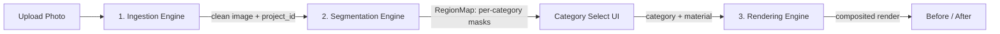

# 00 - Overview & Scope

## What this is

**AI Exterior Studio** is a pre-construction visualization tool. A user uploads a
photo of a house exterior, selects a facade element (walls, balconies, rooftop,
gate, ...), and the system **automatically segments** that element and **fills it
with a chosen material** (paint or texture), producing a photorealistic redesign
of *their actual house* with the original structure and lighting preserved.

## Design shape: three engines + one contract

The pipeline is three engines glued by a single data structure, the **RegionMap**.

1. **Ingestion Engine** - validate + normalize the upload (see `02`).
2. **Segmentation Engine** - CPU Grounded-SAM turns text categories into masks (see `03`).
3. **Rendering Engine** - classical CV fills each region with material (see `04`).

The **RegionMap** (`{category, mask, polygons, pixel_area, confidence}`) is the
only contract between segmentation and rendering (see `05`).

## In scope

- Upload + quality gate.
- Category-based auto-segmentation of: wall, balcony, rooftop, gate, window, door
  (+ railing, pillar available).
- Material application per region: paint (LAB recolor) and textures (stone, tile,
  plaster) via physical tiling.
- Before/after comparison.
- MVC architecture, FastAPI backend + Next.js frontend, **CPU-only**.

## Out of scope (explicitly excluded now)

- **Surface-area estimation engine.**
- **Cost / quantity engine.**
- Diffusion-based rendering (SDXL / ControlNet).
- Auth, multi-user, multi-photo fusion, PDF report.

The RegionMap intentionally leaves room to attach `real_area` and `material_qty`
later without breaking the contract, so estimation/cost can be added as a fourth
engine that only *reads* the RegionMap.

## Key decisions

| Decision | Choice | Rationale |
|----------|--------|-----------|
| Compute | CPU-only, no GPU | User constraint; drives all model choices |
| Segmentation | Grounded-SAM (Grounding DINO tiny + SAM vit-base) | Zero-shot text prompts cover balcony/rooftop/gate that ADE20K cannot |
| Selection UX | Category buttons | User clicks "Walls" -> all walls segment at once |
| Rendering | Classical CV only | Fast, free, CPU-friendly, structure-preserving |
| Backend | FastAPI (MVC + services) | Python AI ecosystem, typed, async, auto docs |
| Frontend | Next.js (App Router, TS) | Modern React UI with interactive canvas |

## Glossary

- **RegionMap** - the per-category mask + metadata contract.
- **Category** - a facade element type (wall, balcony, ...).
- **Wall derivation** - computing walls as `building - openings` instead of detecting them directly.
- **Render path** - `paint` (LAB recolor) vs `texture` (tiling).
