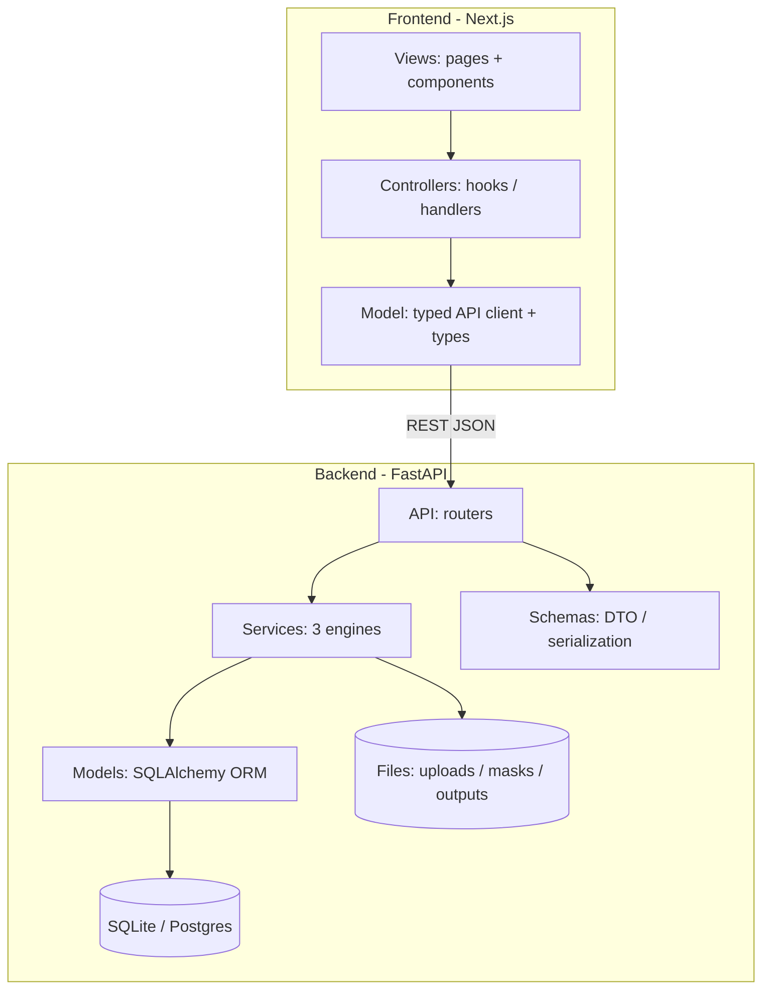
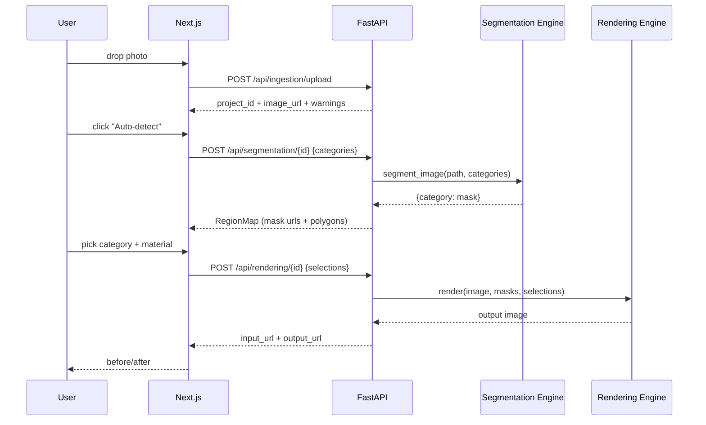

# 01 - Architecture & MVC

## System architecture



Everything runs on CPU. Segmentation is the only slow stage; it is designed so
the image embedding is computed once and reused across categories (see `03`).

## Backend layers (models / schemas / services / api)

Conventional FastAPI structure - four clear layers:

- **models** - persistence + domain state (SQLAlchemy ORM).
- **schemas** - Pydantic request/response DTOs (serialization).
- **services** - the three engines: framework-agnostic, unit-testable business logic.
- **api** - FastAPI routers: HTTP routing, validation, wiring the layers together.

## Backend folder structure

```
backend/
  app/
    core/config.py            # all tunables (models, thresholds, paths)
    db/
      base.py                 # declarative Base
      session.py              # engine + get_db dependency
    models/                   # SQLAlchemy ORM
      project.py  region.py  material.py
    schemas/                  # Pydantic DTOs (serialization)
      project.py  region.py  rendering.py  material.py
    services/                 # business logic - the engines
      ingestion_engine.py
      segmentation/           # Grounded SAM (DINO + SAM vit-base)
        base.py  common.py  grounded_sam.py
      rendering/              # pluggable render modes + registry
        base.py  classical.py  controlnet.py
      catalog.py
    api/                      # FastAPI routers (aggregated in api/__init__.py)
      ingestion.py  segmentation.py  rendering.py  materials.py  meta.py
    utils/
      categories.py           # category -> prompts + color taxonomy
      image_io.py             # URL mapping, mask save, polygonize
    main.py                   # app wiring, static mount, lifespan seed
  scripts/generate_textures.py
  storage/{uploads,masks,outputs,textures}
  requirements.txt
```

## Frontend folder structure

```
frontend/
  app/
    layout.tsx
    page.tsx                       # upload view
    studio/[projectId]/page.tsx    # studio controller view
    globals.css
  components/                      # presentational views
    UploadDropzone.tsx
    StudioCanvas.tsx
    CategoryPanel.tsx
    MaterialPicker.tsx
    BeforeAfter.tsx
  lib/                             # model + controller
    api.ts   types.ts   config.ts
```

## Request / data flow (happy path)



## Async note (CPU reality)

Segmentation on CPU can take ~10-40s the first time. This build runs it
synchronously for simplicity; the documented upgrade path is a background job
(Celery/RQ + Redis) with a `GET /segmentation/{id}/status` poll, without
changing the RegionMap contract.

## Tech stack

| Layer | Choice |
|-------|--------|
| API | FastAPI + Uvicorn |
| ORM / DB | SQLAlchemy 2.x + SQLite (Postgres-ready) |
| Validation | Pydantic v2 + pydantic-settings |
| CV | OpenCV (headless), NumPy, Pillow |
| Segmentation | torch (CPU), transformers (Grounding DINO + SAM) |
| Frontend | Next.js 15, React 19, TypeScript, Tailwind |
