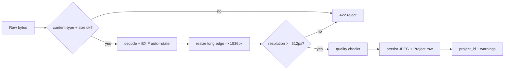

# 02 - Ingestion Engine

**Code:** `backend/app/services/ingestion_engine.py`
**Routes:** `backend/app/api/ingestion.py`

## Responsibility

Turn a raw upload into a clean, normalized working image and a persisted
`Project`, while returning user-actionable quality warnings. Garbage in is
caught here so the Segmentation Engine only ever sees usable images.

## Pipeline



## Steps

1. **Validate bytes** - reject non-image content types and files > 20 MB.
2. **Decode + orient** - Pillow decode, `ImageOps.exif_transpose` to honor camera
   orientation, then strip EXIF by re-encoding. Convert to RGB.
3. **Resize** - Lanczos downscale so the long edge is <= `MAX_IMAGE_LONG_EDGE`
   (1536px). Keeps memory and inference time bounded.
4. **Resolution floor** - reject anything below `MIN_IMAGE_LONG_EDGE` (512px).
5. **Quality checks** (warnings, not hard failures):
   - **Blur** - variance of the Laplacian below `BLUR_LAPLACIAN_MIN` (60).
   - **Exposure** - grayscale mean outside `[25, 235]` -> too dark / too bright.
6. **Persist** - save normalized JPEG to `storage/uploads/{project_id}.jpg`,
   insert a `Project` row, return `project_id`.

## Configurable thresholds (`core/config.py`)

| Setting | Default | Meaning |
|---------|---------|---------|
| `MAX_IMAGE_LONG_EDGE` | 1536 | Stored working resolution |
| `MIN_IMAGE_LONG_EDGE` | 512 | Hard reject below this |
| `BLUR_LAPLACIAN_MIN` | 60.0 | Below => "blurry" warning |
| `DARK_MEAN_MIN` | 25.0 | Below => "too dark" |
| `BRIGHT_MEAN_MAX` | 235.0 | Above => "too bright" |
| `MAX_UPLOAD_BYTES` | 20 MB | Upload size cap |
| `ALLOWED_CONTENT_TYPES` | jpeg/png/webp | Accepted formats |

## Output contract

`IngestResponse`:

```json
{
  "project": {
    "id": "…", "filename": "…", "image_url": "/storage/uploads/….jpg",
    "width": 1536, "height": 1024, "status": "ingested", "created_at": "…"
  },
  "warnings": [{ "code": "blurry", "message": "Image looks blurry - …" }]
}
```

## Future hook (out of scope now)

A building-presence check (Grounding DINO prompt "building/house") can be added
here to reject selfies/interiors, reusing the same model the Segmentation Engine
loads. Deferred to keep ingestion fast and model-free.
