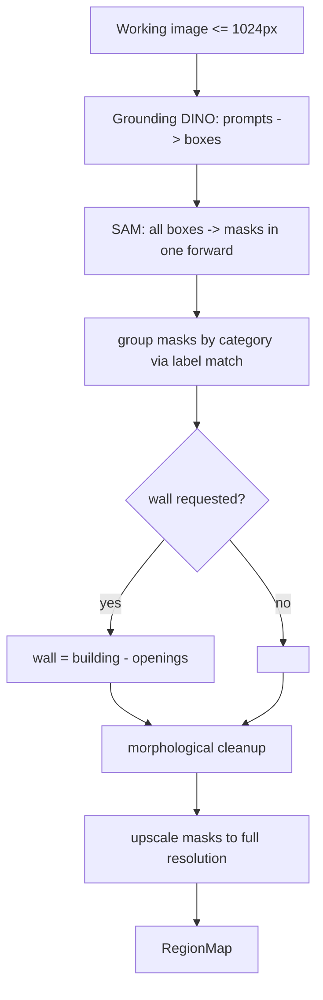

# 03 - Segmentation Engine

**Code:** `backend/app/services/segmentation/` (package)
**Routes:** `backend/app/api/segmentation.py`, `backend/app/api/meta.py` (`GET /meta/models`)
**Taxonomy:** `backend/app/utils/categories.py`

## Goal

Given an image, a list of **categories**, and a chosen **model**, return one
binary mask per category at full image resolution, plus confidence and instance
count.

## Model

| UI label | Key | Pipeline | Host | Weights |
|----------|-----|----------|------|---------|
| Grounding DINO + SAM | `grounded_sam` | Grounding DINO tiny → SAM masks | **CPU** | open |

The backend implements the `SegBackend` ABC (`is_available()`, `segment()`) and
returns `{category: CategoryMask}`. `segment_image(image, categories, model)`
returns `(backend_used, masks)`.

**Availability:** if Grounded SAM can't load (missing weights), the API returns
**HTTP 503**. `GET /meta/models` reports `available` so the UI can surface status.

## Model details: Grounded-SAM

| Component | Model | Why |
|-----------|-------|-----|
| Detector | Grounding DINO **tiny** (`IDEA-Research/grounding-dino-tiny`, Swin-T) | Zero-shot: free-text prompts ("balcony", "rooftop", "gate") with no training data |
| Segmenter | **SAM** `facebook/sam-vit-base` | Turns each detected box into a precise pixel mask |

Why not the reference's Segformer/ADE20K? ADE20K has `wall/window/door/railing`
but **no balcony, rooftop, or gate** classes - exactly the elements the product
must support. Grounding DINO's open-vocabulary prompts solve this directly.

## Why category-based, not click-based

The user picks a category ("Walls"); Grounding DINO detects *all* instances of
that category in one pass, SAM masks them, and they are unioned into one mask.
No per-instance clicking required.

## Pipeline



## Category -> prompt mapping

| Category | Prompts | Overlay color | Notes |
|----------|---------|---------------|-------|
| `wall` | wall, building facade, exterior wall | red | **Derived**, not detected |
| `balcony` | balcony, balcony railing | amber | |
| `rooftop` | roof, rooftop | purple | |
| `gate` | gate, front gate, metal gate | sky | |
| `window` | window | blue | opening (carved from wall) |
| `door` | door | green | opening |
| `railing` | railing | yellow | opening |
| `pillar` | pillar, column | pink | |

Default categories: `wall, balcony, rooftop, gate, window, door`.

## Wall derivation trick

Walls are a *background* class that detectors mask poorly. Instead:

```
building_mask = SAM(box from "building" prompt)
openings      = union(window, door, balcony, gate, railing)
wall_mask     = building_mask - dilate(openings)
```

If no "building" box is found, fall back to a GrabCut foreground silhouette.

## CPU strategy (critical)

- **Downscale** to `SEG_WORKING_LONG_EDGE` (1024px) for inference, then upscale
  masks with nearest-neighbor back to stored resolution.
- **One SAM forward** for all boxes in the image (boxes batched together).
- **Single Grounding DINO pass** over all category prompts joined as
  `"wall. balcony. gate. …"`.
- **Lazy singleton** model loading (thread-safe) so weights load once per process.
- `TORCH_THREADS` configurable to bound CPU usage.

### Expected CPU timings (rough, first call includes model download)

| Stage | Cold (first call) | Warm |
|-------|-------------------|------|
| Model download | one-time ~1 GB | - |
| Grounding DINO | 3-8 s | 3-8 s |
| SAM (few boxes) | 4-15 s | 4-15 s |
| Total per image | ~10-40 s | ~10-25 s |

### Documented upgrade path (faster CPU)

- Swap SAM vit-base for **MobileSAM / FastSAM / EdgeSAM / EfficientViT-SAM**.
- Export to **ONNX Runtime / OpenVINO**, apply **int8 quantization**.
- Cache the SAM image **embedding** per image; re-segmenting a new category then
  only re-runs the cheap mask decoder.
- Move to a background job + status polling.

## Post-processing

- Morphological close + open (5x5) to fill holes and drop speckle.
- Polygonize with `findContours` + Douglas-Peucker (`approxPolyDP`) for the
  frontend, dropping contours under a minimum area.

## Output (RegionMap, per category)

```json
{
  "category": "wall",
  "mask_url": "/storage/masks/Gate_bunglow 1.png",
  "polygons": [[[x,y], …]],
  "pixel_area": 148230,
  "confidence": 0.42,
  "instance_count": 1
}
```

Masks are persisted as category-tinted RGBA PNGs named
`{Category}_{imageName}.png` (e.g. `Gate_bunglow 1.png`); rendering reads the alpha
channel as the binary mask. Final renders are saved as `Output_{imageName}.jpg`.
