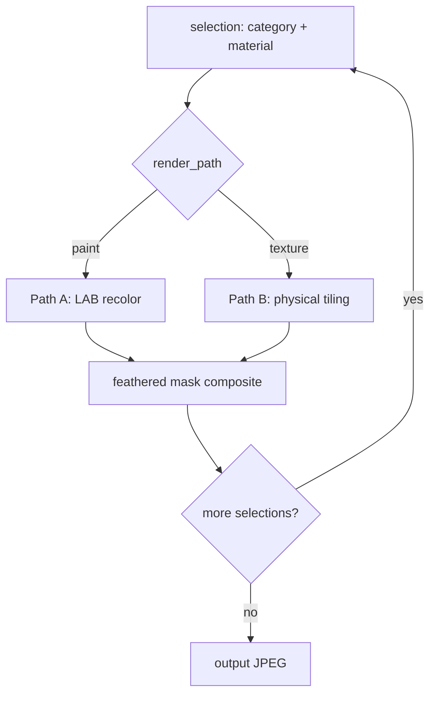

# 04 - Rendering Engine

**Code:** `backend/app/services/rendering/` (package)
**Routes:** `backend/app/api/rendering.py`, `backend/app/api/meta.py` (`GET /meta/render-modes`)

## Goal

Fill each selected region's mask with its chosen material, preserving the
original building's geometry, shadows and lighting.

## Selectable render modes (render-mode selector)

The UI exposes a render-mode bar; the request carries `mode` and the backend
routes to the matching strategy via a registry (`services/rendering/__init__.py`).

| UI label | Key | Approach | Host | Deps |
|----------|-----|----------|------|------|
| Classical CV | `classical` | LAB recolor + physical texture tiling | **CPU** (default) | none |
| ControlNet (AI) | `controlnet` | SD inpainting + Canny ControlNet | GPU (slow on CPU) | optional |

Each mode implements the `RenderBackend` ABC (`is_available()`, `render()`).
`render_image(image_path, selections, mask_loader, mode, output_name=...)` returns
`(backend_used, output_path)`. Final files are saved as `Output_{imageName}.jpg`
under `storage/outputs/`.
`(backend_used, output_path)`.

**Availability & fallback:** if `controlnet` can't load (missing `diffusers` /
weights / GPU), the API returns **HTTP 503** with a readable message - unless
`RENDER_ALLOW_FALLBACK=true`, in which case it degrades to `classical`. A runtime
failure during diffusion also degrades to `classical` rather than a 500.
`GET /meta/render-modes` reports `available` per mode so the UI can disable modes
the host can't run.

## Classical mode - two render paths (routed by material)



### Path A - paint / finish (LAB recolor)

1. Convert the image to **LAB** color space.
2. **Keep the L (luminance) channel** - this holds shadows, depth and texture.
3. Replace the **A/B chroma** channels with the target color's chroma.
4. **Luminance-weighted attenuation**: bright pixels (white trim, highlights)
   resist tinting via `tint = clip(1 - (L-0.65)/0.35)`, so highlights survive.
5. Convert back to BGR.

Result: the new color follows the wall's real 3D shading - it looks like *their*
house, and structure is preserved by construction.

### Path B - material replacement (stone / tile / plaster)

1. Compute **pixels-per-meter** from a reference door height (~7 ft = 2.13 m,
   estimated as ~25% of image height).
2. Resize the texture to a **physically plausible tile size**
   (tile 60x60 cm, stone 45x30 cm, plaster 1x1 m) and tile it across the canvas.
3. Modulate the tiled texture by the **CLAHE-boosted L channel** of the original
   (`texture * L^0.75`), so grout/joint lines follow real shadows.

## Compositing

- Each region is confined to its binary mask with a **feathered edge**
  (Gaussian-blurred alpha) to avoid a "pasted flat" look:
  `canvas = canvas*(1-alpha) + overlay*alpha`.
- Selections are applied **sequentially** onto one canvas, so a single render can
  restyle walls + rooftop + gate together.
- Output saved to `storage/outputs/Output_{imageName}.jpg`.

## Material catalog

Seeded by `backend/app/services/catalog.py` into the `materials` table:

| key | name | render_path | asset |
|-----|------|-------------|-------|
| `paint` | Wall Paint | paint | color hex |
| `stone` | Stone Cladding | texture | `storage/textures/stone.jpg` |
| `tiles` | Wall Tiles | texture | `storage/textures/tile.jpg` |
| `plaster` | Texture Plaster | texture | `storage/textures/plaster.jpg` |

Placeholder textures are generated by `scripts/generate_textures.py`; swap in
real tileable photos for production quality.

## ControlNet mode (optional, AI)

For photorealistic material filling, `controlnet` repaints each masked region
from a text prompt while a **Canny-edge ControlNet** preserves the building's
structure (window frames, edges, rooflines). Code: `services/rendering/controlnet.py`.

Pipeline (`StableDiffusionControlNetInpaintPipeline`, SD1.5 inpaint + Canny):

1. Downscale the image to `SD_WORKING_LONG_EDGE` (768px, multiple of 8) and
   compute Canny edges as the control image.
2. For **each selection**, build a material prompt and run one inpaint pass with
   the category mask as the inpaint mask, feeding the running canvas as init so
   multiple elements accumulate.
3. Feather-composite only the masked region back each pass, then paste the
   diffused regions onto the full-res original (unmasked pixels never change).

Prompt mapping (in `controlnet.py`):

| material_key | prompt fragment |
|--------------|-----------------|
| `paint` | `"<nearest color name> painted exterior wall"` (hex -> color word) |
| `stone` | natural stone cladding wall |
| `tiles` | clean ceramic wall tiles |
| `plaster` | smooth textured plaster wall finish |

Tunables (config): `SD_INPAINT_MODEL`, `CONTROLNET_MODEL`, `SD_WORKING_LONG_EDGE`,
`SD_STEPS`, `SD_GUIDANCE`, `CONTROLNET_SCALE`, `CANNY_LOW/HIGH`. Runs on CUDA if
available (fp16) else CPU (fp32, attention/VAE slicing; ~1-3 min per render).
Weights (~2-4 GB) download on first render. Enable via
`pip install -r backend/requirements-diffusion.txt`.

## Request contract

```json
POST /api/rendering/{project_id}
{
  "mode": "classical",
  "selections": [
    { "category": "wall",    "material_key": "paint", "color": "#1E3A8A" },
    { "category": "rooftop", "material_key": "tiles" }
  ]
}
```

Response returns `input_url`, `output_url`, and `backend` (the mode that ran) for
the before/after slider.
