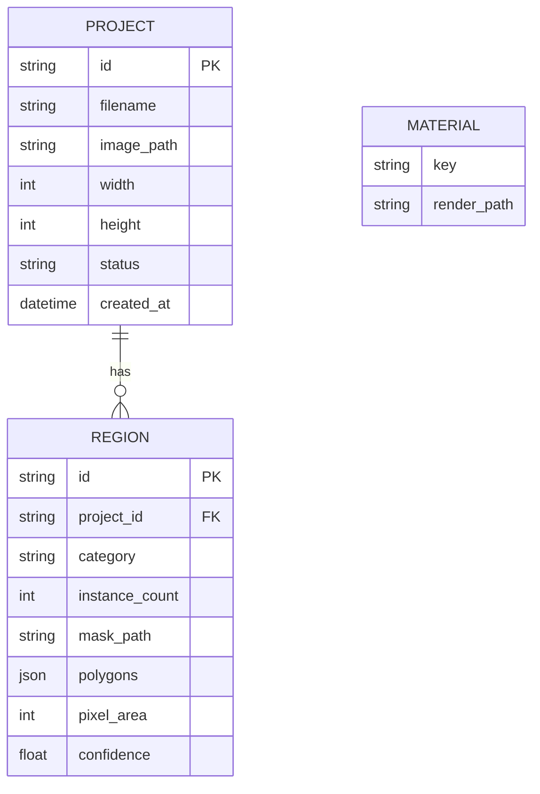

# 05 - Data Contracts & API

## The RegionMap contract

The single structure shared between Segmentation (writer) and Rendering (reader).
Persisted as `Region` rows; serialized as `RegionOut`.

| Field | Type | Source | Notes |
|-------|------|--------|-------|
| `id` | str | segmentation | uuid |
| `project_id` | str | ingestion | FK |
| `category` | str | request | wall/balcony/rooftop/gate/... |
| `instance_count` | int | segmentation | number of detected instances merged |
| `mask_url` | str | segmentation | tinted RGBA PNG (alpha = mask) |
| `polygons` | number[][][] | segmentation | simplified contours for the UI |
| `pixel_area` | int | segmentation | white pixels in the mask |
| `confidence` | float | segmentation | mean detection score |

Reserved for the future estimation/cost engine (not populated now):
`real_area_sqft`, `material_id`, `material_qty`. They can be added without
breaking existing consumers.

## Database schema



- **Project.status**: `ingested -> segmented -> rendered`.
- SQLite by default; swap `DATABASE_URL` for Postgres with no code change.
- Binary assets live on disk under `storage/`, served at `/storage/...`.

## REST API

Base prefix: `/api`.

| Method | Path | Body | Returns |
|--------|------|------|---------|
| POST | `/ingestion/upload` | multipart `file` | `IngestResponse` |
| GET | `/ingestion/projects/{id}` | - | `ProjectOut` |
| POST | `/segmentation/{id}` | `{categories: string[]}` | `SegmentationResponse` |
| GET | `/segmentation/{id}/regions` | - | `SegmentationResponse` |
| GET | `/materials` | - | `MaterialOut[]` |
| GET | `/meta/categories` | - | `{default, categories[]}` |
| POST | `/rendering/{id}` | `{selections: RegionMaterial[]}` | `RenderResponse` |
| GET | `/health` | - | status + backend |

### Selected schemas

```jsonc
// SegmentationRequest
{ "categories": ["wall", "balcony", "rooftop", "gate"] } // [] => defaults

// RegionMaterial (rendering)
{ "category": "wall", "material_key": "paint", "color": "#1E3A8A" }

// RenderResponse
{ "project_id": "…", "input_url": "…", "output_url": "…", "applied": [ … ] }
```

## Error handling

- `422` - unusable upload (bad type/size/resolution), unknown material, missing
  region for a requested category, empty selections.
- `404` - project not found.
- Segmentation degrades to the OpenCV fallback instead of failing when models are
  unavailable; the `backend` field in the response reports which path ran
  (`grounded_sam` / `opencv_fallback` / `opencv`).

## Async upgrade path

`POST /segmentation/{id}` becomes an enqueue returning `{job_id}`, plus
`GET /segmentation/{id}/status -> {state, progress}`; the RegionMap contract is
unchanged.
