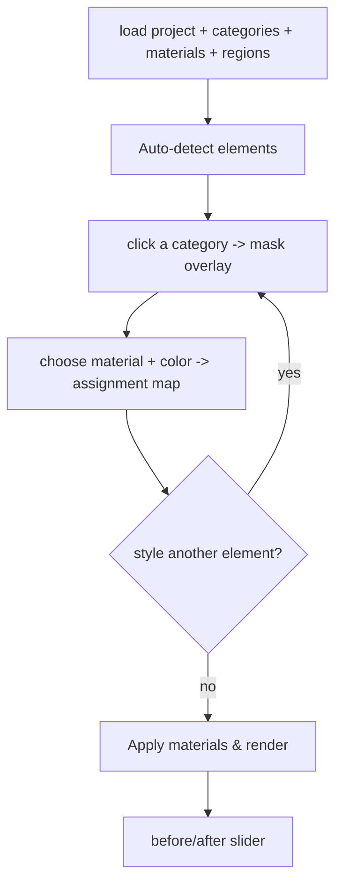

# 06 - Frontend Plan (Next.js)

**Location:** `frontend/`

## Stack

Next.js 15 (App Router) + React 19 + TypeScript + Tailwind CSS.

## MVC-style structure

| MVC role | Location | Contents |
|----------|----------|----------|
| Model | `lib/api.ts`, `lib/types.ts`, `lib/config.ts` | typed API client, DTO types, base URL |
| View | `app/*`, `components/*` | pages + presentational components |
| Controller | `app/studio/[projectId]/page.tsx` hooks/handlers | orchestrates state + API calls |

## Routes

| Route | Purpose |
|-------|---------|
| `/` | Upload view - drag/drop -> `POST /ingestion/upload` -> redirect to studio |
| `/studio/[projectId]` | Studio - segment, select category, pick material, render |

## Components

- **UploadDropzone** - drag/drop upload, shows ingestion warnings, routes to studio.
- **ModelSelector** - segmentation model selection bar (Grounding DINO + SAM,
  SAM 3, Florence-2 + SAM 3) fed by `GET /meta/models`; unavailable models are
  shown disabled with a tooltip. The chosen key is sent as `model` in the
  segmentation request.
- **StudioCanvas** - source photo with the active category's mask overlaid
  (pre-tinted PNG, `mix-blend-screen`).
- **CategoryPanel** - one button per category; disabled until detected; color chip
  matches the mask overlay color from `/meta/categories`.
- **MaterialPicker** - material buttons; color input shown only for paint.
- **RenderModeSelector** - render-mode bar (Classical CV vs ControlNet AI) fed by
  `GET /meta/render-modes`; unavailable modes are shown disabled with a tooltip.
  The chosen key is sent as `mode` in the render request.
- **BeforeAfter** - slider comparing original vs rendered output.

## Studio UX flow

Key state (in the studio page):
- `regions` - the RegionMap from segmentation.
- `activeCategory` - which mask is shown / being styled.
- `models` / `selectedModel` - available segmentation models + the chosen one
  (defaults to the first available, preferring the server default).
- `lastBackend` - the backend actually used, echoed from the response and shown
  next to the detect button.
- `renderModes` / `selectedRenderMode` - available render modes + the chosen one
  (same default-preferring logic); `lastRenderBackend` shows which render mode ran.
- `assignments: Record<category, {material_key, color}>` - accumulates per-element
  choices so one render call restyles multiple elements.

## UX notes

- Segmentation can be slow; the button shows "Detecting (may take a while)..."
  and stays disabled while running.
- If a selected model is unavailable on the host, the backend returns 503 and the
  message is surfaced inline; unavailable models are disabled in the selector.
- After a run, the UI shows which backend produced the masks (`Segmented with …`)
  and which render mode produced the output (`Rendered with …`).
- ControlNet renders are slow; the render button shows "Rendering with AI (may
  take a while)..." when that mode is selected. Unavailable modes are disabled.
- Categories not detected are greyed out (can't select an element that isn't there).
- The before/after view can be dismissed to return to the editor and iterate.

## Config

`NEXT_PUBLIC_API_BASE` (default `http://localhost:8000`) points the client at the
FastAPI backend; media URLs are resolved via `lib/config.ts`.

## Future frontend upgrades

- Canvas brush/eraser to refine masks (human-in-the-loop), like the reference's
  `review.html`, posting an edited mask back to a `PUT /regions/{id}` endpoint.
- Job progress bar once segmentation becomes async.
- Saved design variants for comparison.
