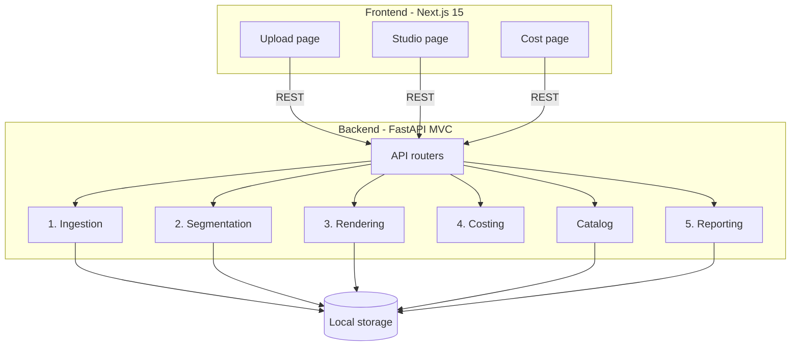
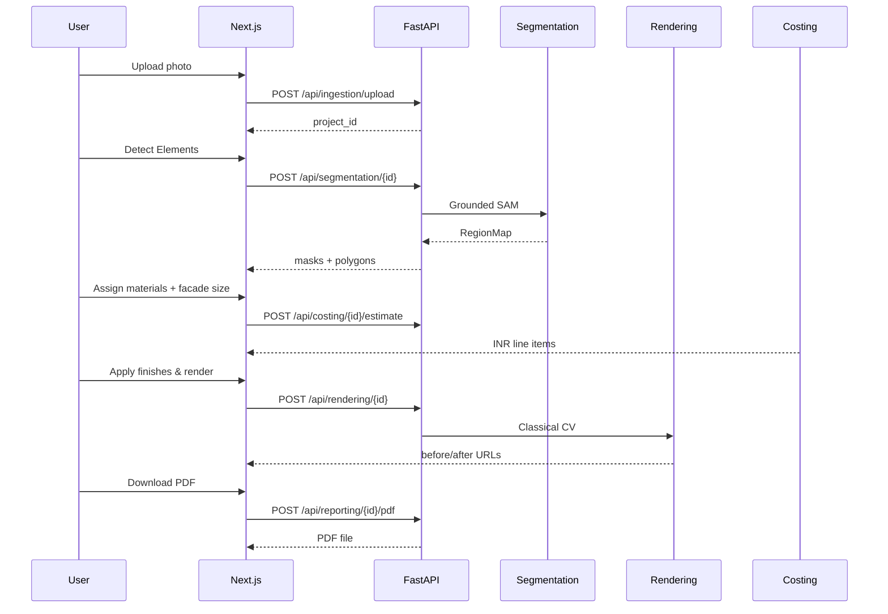

# 02 — System Architecture

**Problem-statement deliverable:** *A system architecture*

## 1. High-level architecture

The platform is a **client–server** app with five backend engines glued by a shared **RegionMap** contract. Uploads, masks, renders, textures, and model weights live on **local disk** under `backend/storage/`.



### Core idea: RegionMap

After segmentation, each facade category becomes a **region**:

| Field | Role |
|-------|------|
| `category` | wall, balcony, rooftop, gate, window, door, … |
| `mask` | Pixel coverage of that element |
| `polygons` | Simplified contours for UI overlay |
| `pixel_area` | Count of mask pixels |
| `instance_count` | How many discrete detections were merged |
| `confidence` | Mean detector score |

Rendering, costing, and reporting all **read** this structure. Costing never invents areas — it only scales mask fractions.

## 2. Backend layers (MVC)

```
backend/app/
  api/         → Controllers (HTTP routers)
  schemas/     → Request/response DTOs (Pydantic)
  services/    → Business logic (engines)
  core/        → Config, logging
  utils/       → Categories, image I/O, model paths
```

| Engine | Responsibility | Primary module |
|--------|----------------|----------------|
| Ingestion | Validate, orient, resize, quality warn, save working image | `services/ingestion_engine.py` |
| Segmentation | Grounding DINO boxes → SAM masks; wall derivation | `services/segmentation/` |
| Rendering | Paint (HSV/LAB shade) or texture tile per region | `services/rendering/classical.py` |
| Catalog | Material list from texture folders + default rates | `services/catalog.py` |
| Costing | Mask × facade area × rate → INR lines | `services/costing.py` |
| Reporting | PDF: before/after, materials, costs | `services/report.py` |

## 3. Frontend structure

```
frontend/
  app/page.tsx                 → Upload view
  app/studio/[projectId]/     → Main studio controller
  app/cost/page.tsx            → Rate card (INR)
  components/                  → Canvas, mask editor, materials, cost panel, before/after
  lib/api.ts                   → Typed REST client
```

## 4. Tech stack

| Layer | Choice | Rationale |
|-------|--------|-----------|
| API | FastAPI + Uvicorn | Typed Python AI stack, OpenAPI docs |
| Frontend | Next.js 15, React 19, TypeScript, Tailwind | App Router UI, canvas workflows |
| Segmentation | Grounding DINO tiny + SAM vit-base (transformers, **CPU**) | Zero-shot text categories; no training data |
| Rendering | OpenCV classical only | Fast, free, structure-preserving on ~8 GB RAM |
| PDF | ReportLab | Self-contained server-side report |
| Storage | Local `backend/storage/` mounted at `/storage` | Uploads, masks, renders, textures, weights |
| Deploy | Docker Compose (recommended) | Fully dockerized local run; ~8 GB RAM for models |

**Deliberate non-choices for this prototype:** GPU/async job queue, Stable Diffusion / ControlNet (memory), full depth/homography survey, authentication. Railway free-tier cloud deploy was evaluated but not used (about 1 GB RAM vs ~8 GB needed — see Doc 07).

## 5. Core data structures (in pipeline / API)

Pipeline concepts exchanged via APIs and local files:

| Concept | Key fields | Where stored / used |
|---------|------------|---------------------|
| **Project** | `id`, filename, image path, width, height, stage | Upload folder + API responses |
| **Region (RegionMap)** | category, mask path, polygons, pixel area, instance count, confidence | Mask files under `storage/masks/` + segmentation API |
| **Material** | key, name, render path, group, unit, rate (INR) | Texture catalog on disk + Cost page rates |

Workflow stages for a project photo: **uploaded** → **segmented** → **rendered**.

## 6. Request sequence (happy path)



## 7. Compute notes

- All ML runs **CPU-only** in this build.  
- Segmentation is synchronous; first request after process start is slow (model warm-up). Subsequent category runs reuse loaded models.  
- Rendering is typically under a few seconds for working resolution (long edge capped, see ingestion settings).  
- Costing is pure CPU math and returns in milliseconds.
