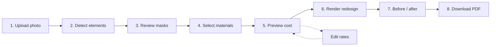

# 03 — User Workflow

**Problem-statement deliverable:** *A user workflow*

## 1. End-to-end journey

## 2. Step-by-step

### Step 1 — Upload (`/`)

- User drops or selects a JPEG / PNG / WebP of the house exterior.  
- Backend **Ingestion Engine** validates type/size, EXIF-orients, resizes long edge, and may return **warnings** (blurry, too dark, too bright).  
- User is redirected to `/studio/{projectId}`.

**Tip for better results:** Straight-on facade photo in good daylight; avoid extreme zoom or heavy obstruction.

### Step 2 — Detect elements (Studio)

- User clicks **Detect Elements**.  
- Default categories: wall, balcony, rooftop, gate, window, door (railing / pillar available in taxonomy).  
- Grounding DINO proposes boxes from text prompts; SAM produces masks.  
- **Walls** are derived as building silhouette minus openings (more reliable than direct “wall” detection).  
- Colored overlays appear on the canvas.

### Step 3 — Review / refine masks

- User selects a category and can **brush / erase** the mask (`MaskEditor`) so missed areas or false positives are corrected.  
- Changes are saved to the RegionMap via `PUT /api/segmentation/{id}/regions/{category}`.  
- This human-in-the-loop step turns an imperfect model into a usable plan.

### Step 4 — Select materials

- For each detected category, user picks:  
  - **Solid paint** + color, or  
  - A **texture** (wall cladding, wall tiles, texture patterns) from the catalog.  
- Selections can be changed and re-rendered.

### Step 5 — Preview cost

- Studio shows a live **cost estimate** panel.  
- User sets approximate **facade width × height (m)** (defaults 12 m × 9 m).  
- Quantities use mask pixel share × facade area × default 10% waste (area materials).  
- Gates / doors / windows / pillars price by **piece count**.  
- Optional: open **`/cost`** to edit material rates (INR); estimates recalculate from stored rates.

### Step 6 — Render redesign

- User clicks **Apply finishes & render**.  
- Classical rendering applies paint (shade-preserving recolor) or tiles textures inside masks, in a fixed layer order (walls first, openings later).  
- Output preserves original geometry and approximate lighting.

### Step 7 — Before / after

- Side-by-side or slider comparison of original vs redesigned image.  
- User may change materials and re-render.

### Step 8 — Download report

- After a successful render, user downloads a **PDF** containing:  
  - Branding / title  
  - Original and redesigned images  
  - Selected materials  
  - Quantity / cost breakdown (INR)  
  - Advisory disclaimer  

The PDF is intended as a **discussion document** with contractors, not a formal quotation.

## 3. Screens and responsibilities

| Screen | Responsibility |
|--------|----------------|
| `/` | Capture project photo |
| `/studio/[projectId]` | Detect, edit, assign finishes, estimate, render, export |
| `/cost` | Maintain editable rate card shared across projects |

## 4. Typical timing (local CPU)

| Stage | Expected order of magnitude |
|-------|-----------------------------|
| Upload + ingest | under 2 s |
| First segmentation (cold models) | tens of seconds to a few minutes |
| Later segmentation / same session | shorter (models warm) |
| Cost estimate | under 1 s |
| Classical render | a few seconds |
| PDF | a few seconds |

Exact times depend on CPU, RAM, and image size.
